# GovChat — AI-Assisted Civic Complaint Routing Platform

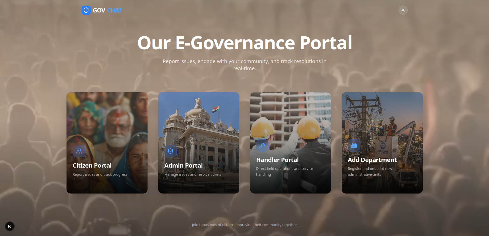

**GovChat** is a full-stack platform that lets citizens report civic issues — potholes, garbage dumps, broken infrastructure, and more — by simply uploading a photo. The system automatically understands the complaint, tags and timestamps it, locates it on a map, groups it with similar nearby complaints, routes it to the correct government department, and lets the citizen follow up through a voice-enabled multilingual chatbot. Department handlers get their own dashboard and mobile app to act on and update complaints in the field.

The project was built in two phases:

| Phase | Branch / Ref | Focus |
|---|---|---|
| **Phase 1** | [`15140afe`](https://github.com/Sri-Ram-A/GovChat/tree/15140afe6f970d2aa508fcfa19cb5c176a95057b) | Core complaint pipeline — vision-based tagging, geolocation, deduplication, voice chatbot, mobile app |
| **Phase 2** | [`gcrag`](https://github.com/Sri-Ram-A/GovChat/tree/gcrag) | Graph RAG — Neo4j-backed scheme recommendation and multi-user interaction |

A detailed, unedited build log of the day-to-day engineering decisions is kept in [`JOURNEY.md`](https://github.com/Sri-Ram-A/GovChat/blob/15140afe6f970d2aa508fcfa19cb5c176a95057b/JOURNEY.md) on the Phase 1 branch.

---

## Table of Contents

- [GovChat — AI-Assisted Civic Complaint Routing Platform](#govchat--ai-assisted-civic-complaint-routing-platform)
  - [Table of Contents](#table-of-contents)
  - [Problem Statement](#problem-statement)
  - [Phase 1 — Core Complaint Pipeline](#phase-1--core-complaint-pipeline)
    - [1. Authentication \& Onboarding](#1-authentication--onboarding)
    - [2. Complaint Intake \& Vision Pipeline](#2-complaint-intake--vision-pipeline)
    - [3. Geolocation \& Reverse Geocoding](#3-geolocation--reverse-geocoding)
    - [4. Spatial Clustering (3 km Radius Grouping)](#4-spatial-clustering-3-km-radius-grouping)
    - [5. Complaint Deduplication](#5-complaint-deduplication)
    - [6. Admin \& Department Dashboards](#6-admin--department-dashboards)
    - [7. Handler Workflow \& Complaint Timeline](#7-handler-workflow--complaint-timeline)
    - [8. Conversational Voice Chatbot](#8-conversational-voice-chatbot)
    - [9. RAG-Based Scheme Q\&A](#9-rag-based-scheme-qa)
    - [10. Multilingual (Kannada) Pipeline](#10-multilingual-kannada-pipeline)
    - [11. Mobile App](#11-mobile-app)
    - [12. API Docs \& Security](#12-api-docs--security)
  - [Phase 2 — Graph RAG \& Scheme Recommendation](#phase-2--graph-rag--scheme-recommendation)
  - [Tech Stack](#tech-stack)
  - [Repository Structure](#repository-structure)
  - [Getting Started](#getting-started)
    - [Prerequisites](#prerequisites)
    - [Backend Setup (Django)](#backend-setup-django)
    - [Frontend Setup (Next.js)](#frontend-setup-nextjs)
    - [Speech Microservices (gRPC — Vosk STT + Kokoro TTS)](#speech-microservices-grpc--vosk-stt--kokoro-tts)
    - [Model Training Notebooks](#model-training-notebooks)
    - [Environment Variables](#environment-variables)
  - [Project Status](#project-status)
  - [Contributors](#contributors)

---

## Problem Statement

Citizens routinely encounter civic issues but have no simple, low-friction way to report them to the *right* department, and municipal bodies have no easy way to see which reports are duplicates, which are clustered in the same neighborhood, or which scheme a citizen might be eligible for. GovChat addresses this by turning a single photo upload into a fully classified, geotagged, deduplicated, department-routed complaint, backed by role-specific dashboards for citizens, admins, and handlers, and a conversational assistant so citizens can ask questions in natural language — including their native language — about complaint status or government welfare schemes.

---

## Phase 1 — Core Complaint Pipeline

### 1. Authentication & Onboarding

GovChat supports three distinct roles — **citizen**, **admin**, and **handler** — each with its own login flow and landing dashboard, secured with JWT-based authentication.

<table>
<tr>
<td>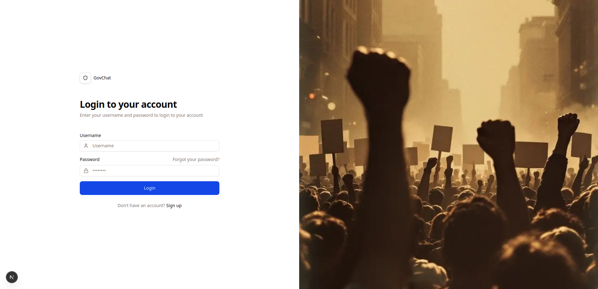<br/><sub>Login</sub></td>
<td>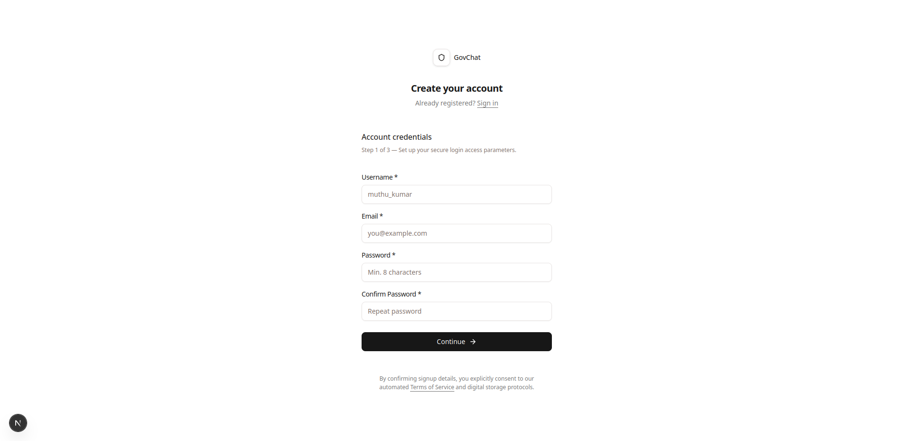<br/><sub>Citizen registration</sub></td>
<td>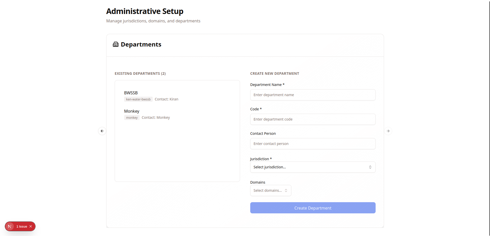<br/><sub>Department registration</sub></td>
</tr>
</table>

Once logged in, each role lands on a dashboard tailored to it:

<table>
<tr>
<td>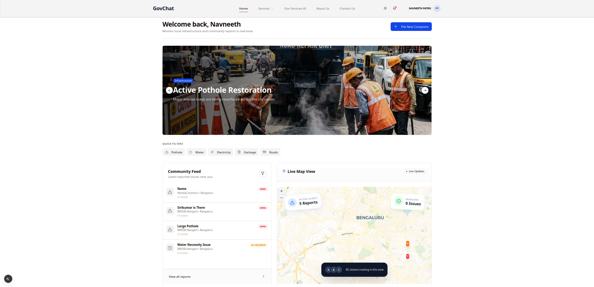<br/><sub>Citizen dashboard</sub></td>
<td>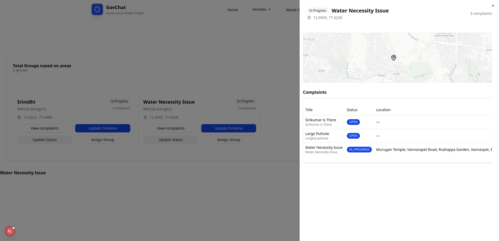<br/><sub>Admin dashboard</sub></td>
<td>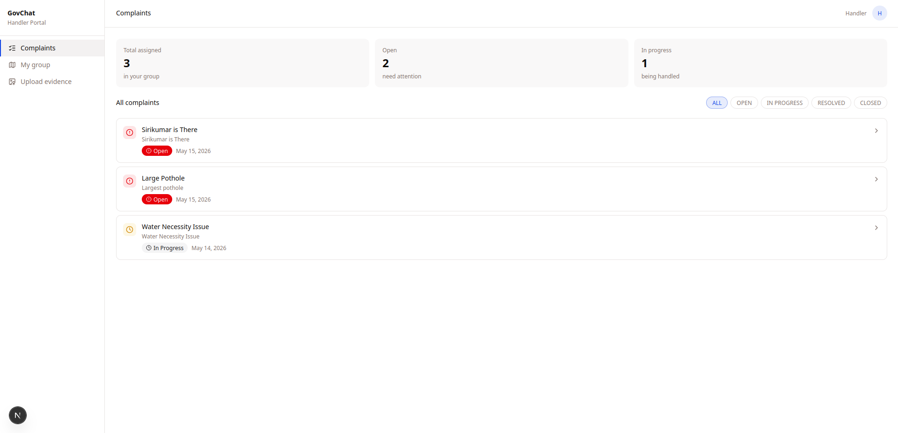<br/><sub>Handler dashboard</sub></td>
</tr>
</table>

Citizens also have a profile page to manage their account details:

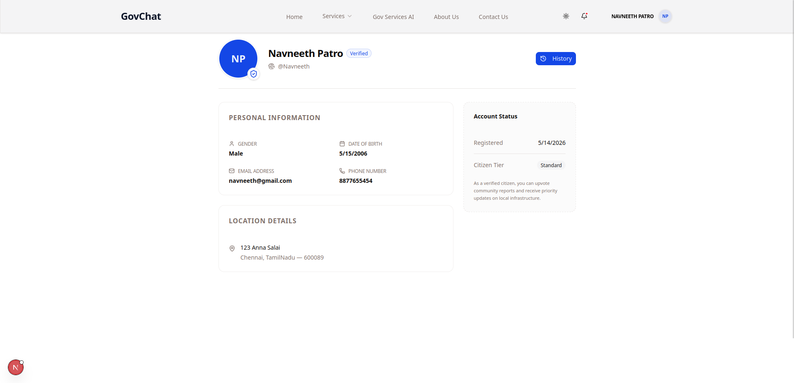

### 2. Complaint Intake & Vision Pipeline

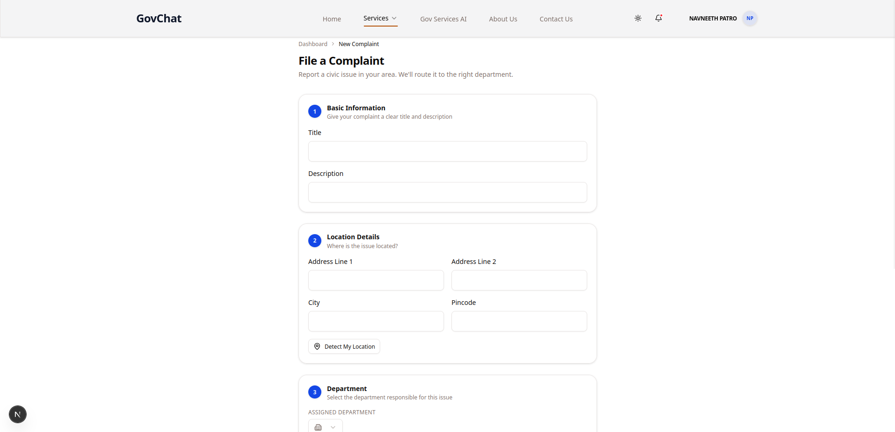

When a citizen uploads an image of an issue (e.g., a pothole or overflowing garbage bin):

- The image is first passed through a **Vision Transformer (ViT)**, which generates a natural-language description of what is in the photo.
- On top of the base ViT, an **additional classification head was trained from scratch** (see the `notebooks/` directory for the training experiments) to classify the image directly into one of the available civic departments (e.g., roads, sanitation, electricity).
- This classification output is used to **automatically tag the complaint with the correct department** and **timestamp** it at the moment of creation — removing the need for the citizen to manually pick a category.

### 3. Geolocation & Reverse Geocoding

- The citizen's device coordinates are captured automatically at the time of complaint submission.
- These raw latitude/longitude coordinates are converted into a **human-readable address** using the **LocationIQ API**, so both citizens and department handlers can immediately understand *where* an issue is, not just its coordinates.

### 4. Spatial Clustering (3 km Radius Grouping)

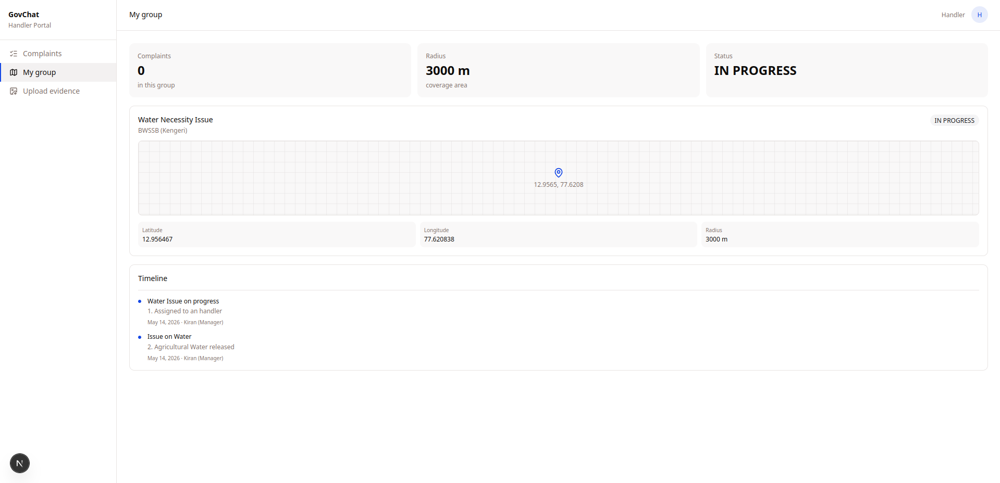

- Once a complaint has a department tag and a location, it is grouped with other complaints of the **same department that fall within a 3 km radius**.
- This clusters multiple independent reports of the *same underlying problem* (e.g., ten different citizens reporting the same stretch of broken road) into a single logical "circle," so departments see one aggregated issue instead of many redundant tickets.

### 5. Complaint Deduplication

- To further reduce noise from repeat photos of the same issue, GovChat uses **Perceptual Hashing (pHash)** on uploaded images.
- Perceptual hashes are compared across incoming complaints so that near-identical images can be flagged and merged, rather than treated as new, unrelated reports.

### 6. Admin & Department Dashboards

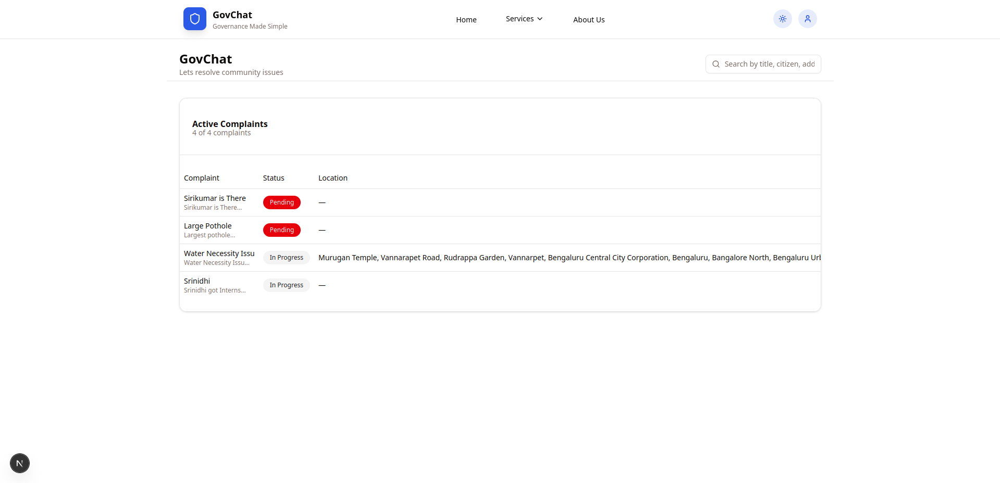

- Admins get a consolidated view of every complaint across departments, with filters for status, department, and location cluster.
- Citizens can similarly browse all complaints raised in their area for transparency:

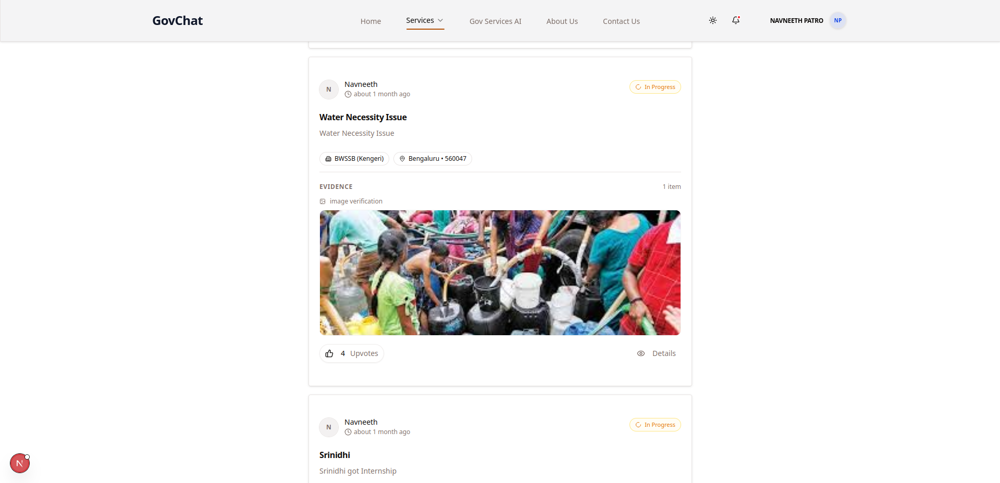

### 7. Handler Workflow & Complaint Timeline

Handlers are the on-ground staff responsible for resolving complaints. Work is assigned to handlers by admins, and each handler can update progress directly, which citizens can then track on a timeline view.

<table>
<tr>
<td>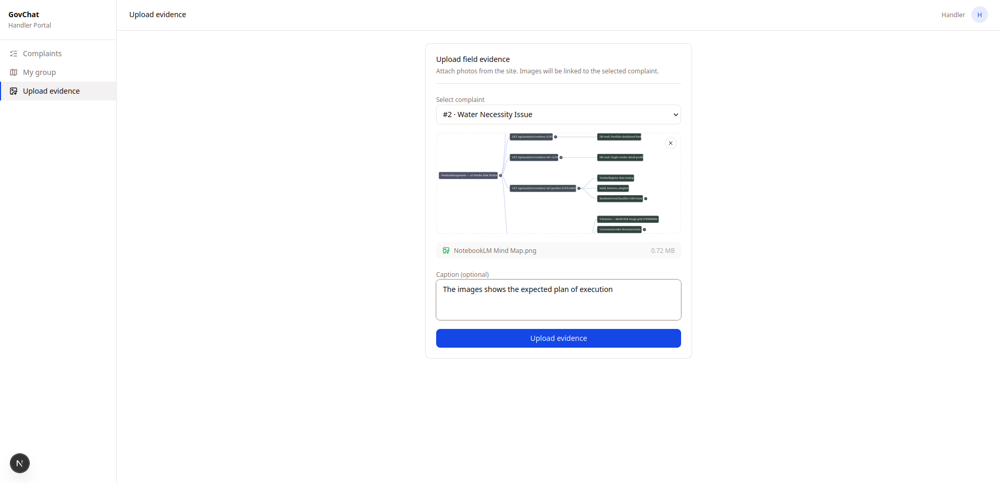<br/><sub>Handler uploading evidence of resolution</sub></td>
<td>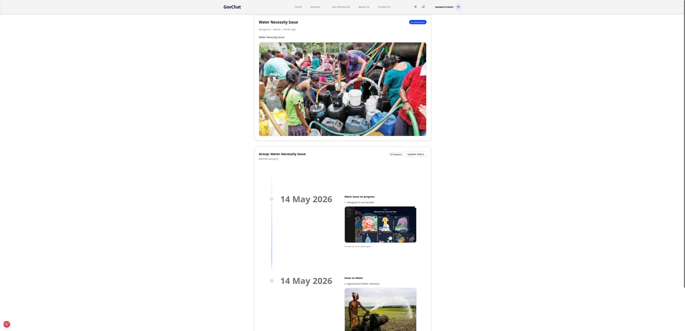<br/><sub>Citizen-facing complaint timeline</sub></td>
</tr>
</table>

### 8. Conversational Voice Chatbot

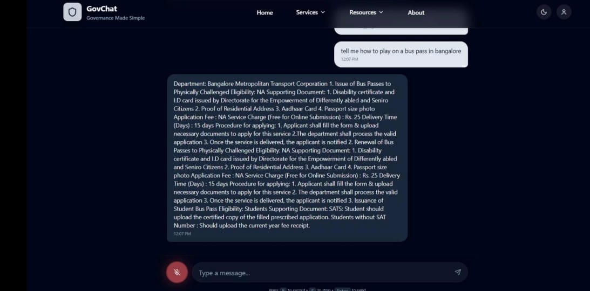

Citizens can talk to a real-time voice assistant instead of filling out forms:

- Audio is streamed between the browser and backend over **WebSockets** (built on Django Channels/Daphne).
- **Speech-to-text** is handled by **Vosk** and **text-to-speech** by **Kokoro TTS**.
- Both STT and TTS were later moved out of the main Django process and into dedicated **gRPC microservices** (containerized with Docker) for scalability and to avoid blocking the web server during audio processing — this migration is documented step-by-step in `JOURNEY.md`, including the move from raw browser audio blobs to 16-bit PCM streaming so Vosk could consume it correctly.

### 9. RAG-Based Scheme Q&A

- The chatbot's text-generation capability is powered by a **Retrieval-Augmented Generation (RAG)** pipeline.
- The knowledge base behind it consists of **custom-scraped data from government scheme websites**, curated into a structured Question–Answer format, so the assistant can answer citizen queries about welfare schemes and eligibility accurately and with grounded sources rather than hallucinating.

### 10. Multilingual (Kannada) Pipeline

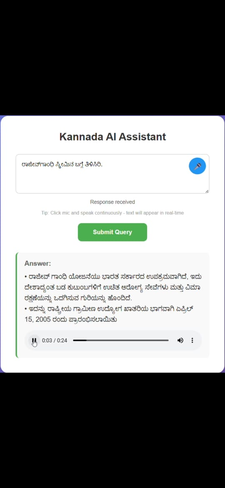

- A **Kannada language pipeline**, contributed by [SRINIDHI3628](https://github.com/SRINIDHI3628/kannada-pipeline), extends the voice assistant so citizens can interact fully in Kannada in addition to English — from speech input through to spoken responses.

### 11. Mobile App

A companion **mobile app was built with Flutter**, backed by a lightweight **Flask** service (alongside the main Django REST Framework backend), aimed at citizens and handlers who prefer a native mobile experience.

<table>
<tr>
<td>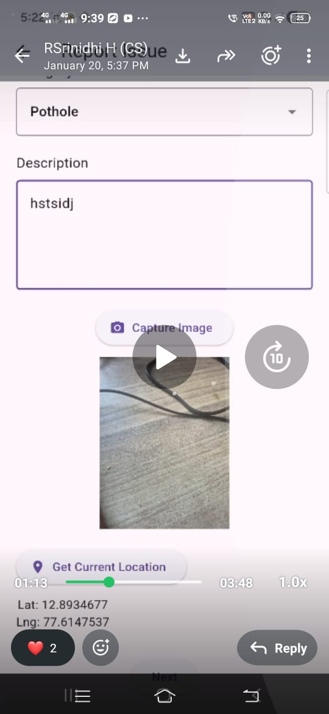<br/><sub>Filing a complaint from the app</sub></td>
<td>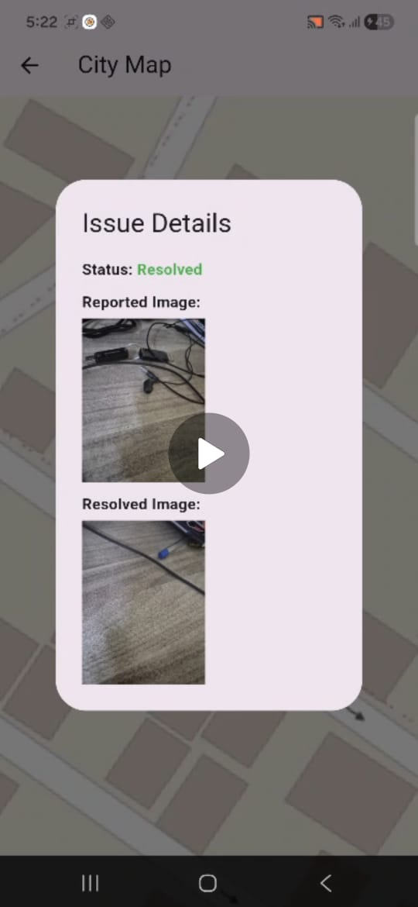<br/><sub>Tracking complaint status from the app</sub></td>
</tr>
</table>

### 12. API Docs & Security

- **JWT-based authentication** protects citizen, admin, and handler roles alike.
- **Swagger UI** documents and allows interactive testing of the REST API exposed by Django REST Framework.

---

## Phase 2 — Graph RAG & Scheme Recommendation

Phase 2, developed on the [`gcrag`](https://github.com/Sri-Ram-A/GovChat/tree/gcrag) branch, extends the RAG pipeline from a flat vector search into a **Graph RAG** architecture:

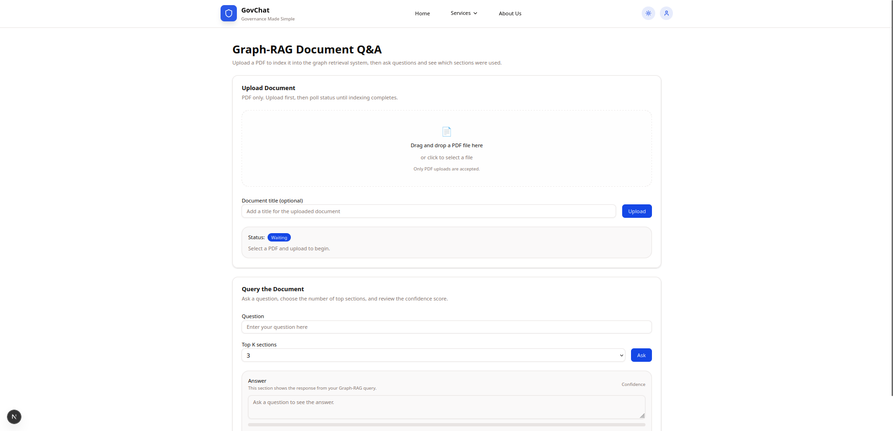

- Government scheme **PDFs are converted into a knowledge graph** rather than being chunked and dumped into a flat vector index.
- The graph is stored and queried using **Neo4j**.
- At query time, instead of doing a similarity search across the *entire* vector database, the system retrieves relevant information by comparing against the **central (representative) vector of each graph/cluster**, which narrows the search space and produces more contextually coherent, faster answers.
- This phase also introduced:
  - **Multi-user interaction** on top of scheme recommendation, so recommendations and conversations can account for more than one participant in a session.
  - Admin-added, citizen-visible **nearby government services**, plotted on an interactive map:

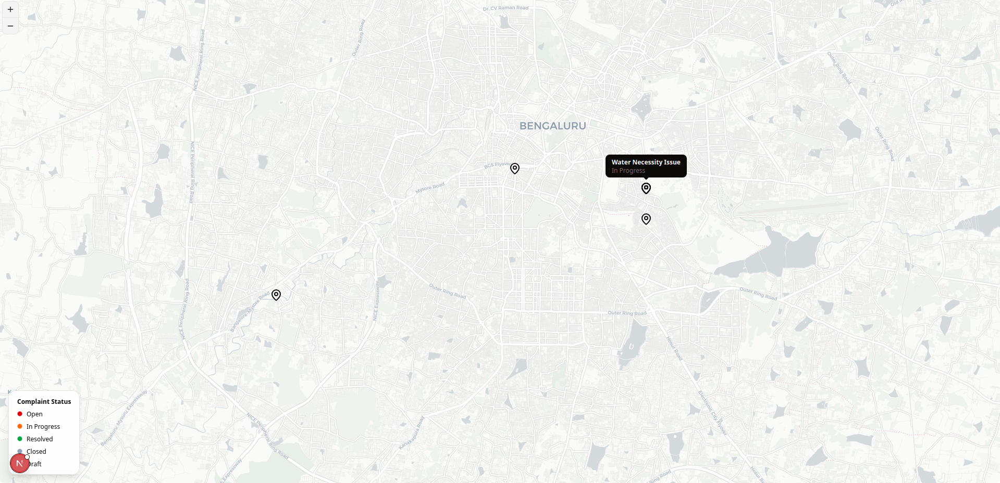

---

## Tech Stack

| Layer | Technology |
|---|---|
| Backend framework | Django 6, Django REST Framework, Django Channels + Daphne (ASGI/WebSockets) |
| Frontend | Next.js (React), TypeScript, Tailwind CSS, shadcn/ui |
| Mobile app | Flutter + Flask backend |
| Computer vision | Vision Transformer (ViT) + custom-trained classification head |
| Speech | Vosk (STT), Kokoro TTS (TTS), gRPC microservices, Docker |
| NLP / Retrieval | RAG pipeline over scraped scheme Q&A data, Graph RAG with Neo4j |
| Geolocation | Browser Geolocation API + LocationIQ (reverse geocoding) |
| Deduplication | Perceptual Hashing (pHash) |
| Auth & API docs | JWT authentication, Swagger UI |
| Data science | Jupyter Notebooks (model training/evaluation) |

---

## Repository Structure

```
GovChat/
├── backend/        # Django project — REST API, WebSocket consumers, models, auth
├── frontend/        # Next.js application (citizen + admin/handler UI)
├── docs/            # Project documentation
├── images/           # Screenshots used in this README
├── keys/            # Local TLS certificates for HTTPS dev server
├── notebooks/        # ViT fine-tuning / classification head training & experiments
├── requirements.txt   # Python dependencies
└── JOURNEY.md         # Chronological engineering build log (Phase 1 branch)
```

> Place the screenshots (`admin-all-complaints.png`, `ai-chatbot.png`, etc.) inside an `images/` folder at the repository root so the previews in this README render correctly on GitHub.

---

## Getting Started

The steps below reconstruct the setup described in `JOURNEY.md`. Adapt paths/IPs to your own machine.

### Prerequisites

- Python 3.10 (via `conda` recommended)
- Node.js + npm
- `mkcert` (or similar) for local HTTPS certificates
- Docker (for the gRPC speech microservices)
- A [LocationIQ](https://locationiq.com/) API key
- A running Neo4j instance (for the Phase 2 Graph RAG features)

### Backend Setup (Django)

```bash
conda create -n govchat python=3.10 -y
conda activate govchat
pip install -r requirements.txt
```

Run the backend with HTTPS locally (WebSocket audio streaming requires a secure context in most browsers):

```bash
cd backend
python manage.py runserver_plus --cert-file ../keys/localhost+3.pem --key-file ../keys/localhost+3-key.pem 0.0.0.0:8000
```

Verify Channels/Daphne are wired up correctly:

```bash
python -c "import channels; import daphne; print(channels.__version__, daphne.__version__)"
python -m django version
```

Before testing complaint routing, create a few departments from the Django admin dashboard so the classifier/router has targets to assign complaints to.

### Frontend Setup (Next.js)

```bash
cd frontend
npm install
npm run dev
```

If running the backend and frontend on separate devices on the same network, replace any hard-coded local IP addresses in the frontend config with your machine's actual LAN IP.

### Speech Microservices (gRPC — Vosk STT + Kokoro TTS)

The STT/TTS services are packaged separately and run as a gRPC server so the main Django process isn't blocked by audio processing:

```bash
# Build the image
docker build -t grpc-retrieval:latest .

# Run the container
docker run -d --name grpc-retrieval-service -p 50054:50054 --restart unless-stopped grpc-retrieval:latest

# Check it's reachable
python -c "import grpc; ch=grpc.insecure_channel('localhost:50054'); print('gRPC port accessible' if ch else 'Failed'); ch.close()"

# View logs
docker logs -f grpc-retrieval-service
```

`numpy` must be pinned below version 2.0 for Kokoro TTS compatibility:

```bash
pip install "numpy<2.0"
```

### Model Training Notebooks

The ViT classification head used for department tagging was trained and evaluated in the `notebooks/` directory. Open these in Jupyter/Colab to inspect the training process, dataset preparation, and evaluation metrics for the tagging model.

### Environment Variables

Create a `.env` file in `backend/` with at least:

```
LOCATIONIQ_API_KEY=your_locationiq_key
JWT_SECRET_KEY=your_jwt_secret
NEO4J_URI=bolt://localhost:7687
NEO4J_USER=neo4j
NEO4J_PASSWORD=your_neo4j_password
```

(Exact variable names may differ slightly depending on how `settings.py` reads them — check `backend/` for the authoritative list.)

---

## Project Status

All core features originally scoped for the project are complete, including items that were previously tracked as pending work:

- ✅ Admin-added, citizen-visible nearby government services (delivered as part of Phase 2's map view)
- ✅ Handler registration and role-based dashboards
- ✅ Work assignment from admins to handlers, with citizen-facing timeline updates
- ✅ Multilingual voice support via the Kannada pipeline
- ✅ Graph RAG–based scheme recommendation with Neo4j

The project is in a stable, demo-ready state across both phases. Future contributions are welcome for expanding language support, refactoring shared frontend components, and adding further department/scheme coverage.

---

## Contributors

- **[Srinidhi](https://github.com/SRINIDHI3628/kannada-pipeline)** 
- **[Sirikumar CS](https://github.com/sirikumar9106)**
- **[Sahana Acharya](https://github.com/Sahana-Acharya7)**
- **[Sahana Vernekar](https://github.com/sahana-mv06)**
- **[Sreeharish TH](https://github.com/TJSreeharish)**
- **[Sri-Ram-A](https://github.com/Sri-Ram-A)** 
---
